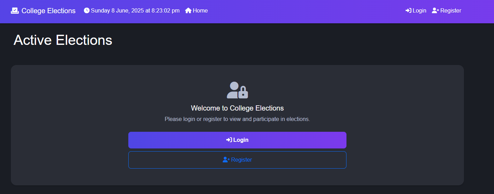
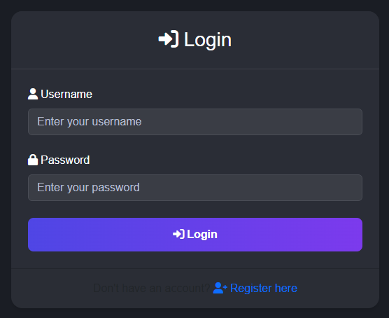
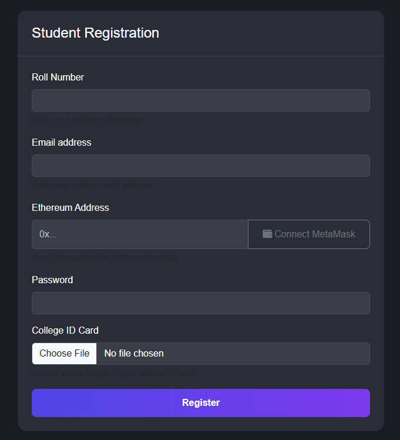
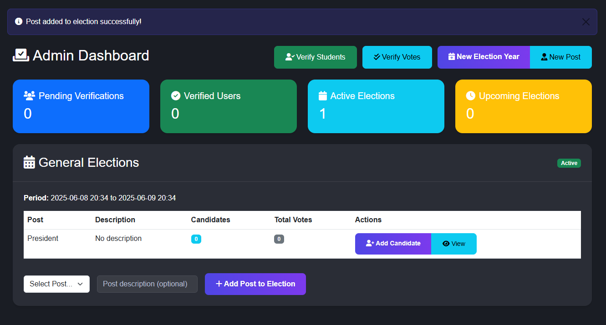
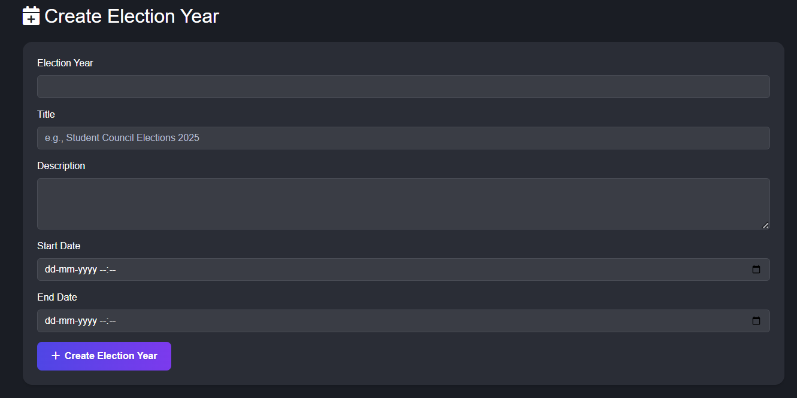
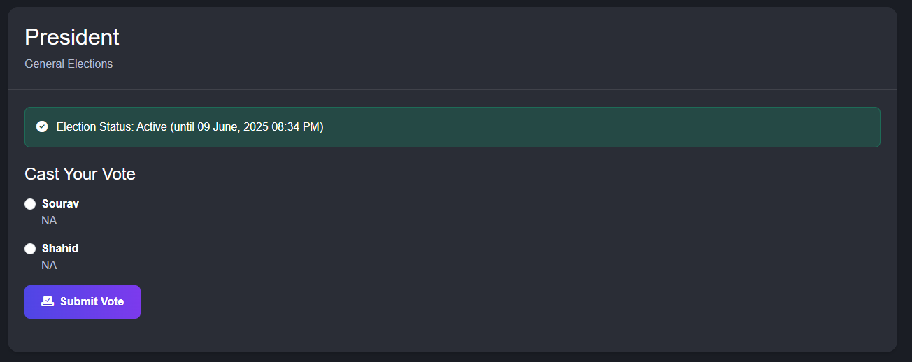

# Blockchain-Based College Election System

A secure and transparent web application for managing college elections, leveraging blockchain technology for vote integrity. Built with Flask and Solidity, this system allows students to register, get verified, and cast their votes, while administrators manage the election process.


## Table of Contents
- [Overview](#overview)
- [Features](#features)
- [Technology Stack](#technology-stack)
- [System Architecture](#system-architecture)
- [Blockchain Integration](#blockchain-integration)
- [Project Design](#project-design)
- [Project Snapshots](#project-snapshots)
- [Setup and Installation](#setup-and-installation)
- [Running the Application](#running-the-application)
- [Usage](#usage)
- [Directory Structure](#directory-structure)
- [Security Features](#security-features)
- [Deployment](#deployment)
- [Future Enhancements](#future-enhancements)
- [Contributing](#contributing)
- [License](#license)
- [Contact](#contact)

## Overview
This project aims to create a modern, secure, and transparent voting system for college elections. By integrating blockchain technology, it ensures that every vote is recorded immutably and can be verified, thus enhancing trust in the election process. The system provides separate interfaces for voters and administrators, catering to their specific needs.

## Features
- **User Management**:
    - Student registration with ID card upload.
    - Admin verification of student accounts.
    - Secure login for students and administrators.
    - Role-based access control.
- **Election Administration**:
    - Admin dashboard for comprehensive election management.
    - Creation and management of Election Years (e.g., "Annual Elections 2024").
    - Creation and management of Election Posts (e.g., "President", "Secretary").
    - Creation of specific Elections by linking Election Years and Posts.
    - Candidate registration and management for each election.
    - Setting election start and end times (IST timezone aware, using NTP for accurate time).
- **Voting Process**:
    - Secure voting interface for verified students.
    - One-vote-per-user per election enforcement.
    - Votes cast are recorded on the Ethereum (Sepolia Testnet) blockchain.
    - Storage of transaction hash for each vote for auditability.
- **Results and Transparency**:
    - Real-time display of election results.
    - Vote verification through blockchain transaction hashes.
    - Admin capability to verify all votes on the blockchain.

## Technology Stack
- **Backend**: Python 3.x, Flask, SQLAlchemy
- **Frontend**: HTML5, CSS3, JavaScript, Jinja2, Bootstrap
- **Blockchain**: Solidity (v0.8.0), Web3.py
- **Ethereum Network**: Sepolia Testnet
- **Database**: SQLite
- **Authentication**: Flask-Login, Werkzeug (password hashing)
- **Deployment**: Render.com, Gunicorn
- **Time Synchronization**: NTP (ntplib), Pytz
- **Environment Management**: python-dotenv

## System Architecture
The application follows a three-tier architecture:
1.  **Presentation Tier (Frontend)**: Handles user interaction through web pages rendered by Flask using Jinja2 templates and Bootstrap for styling.
2.  **Application Tier (Backend)**: Built with Flask, this tier contains the business logic, user authentication, election management, and interacts with both the database and the blockchain.
3.  **Data Tier**: Consists of:
    *   **SQLite Database**: Stores user information, election details, candidate data, etc.
    *   **Ethereum Blockchain (Sepolia)**: Stores vote transactions immutably.

## Blockchain Integration
- **Smart Contract**: `contracts/ElectionContract.sol` is deployed on the Sepolia testnet.
    - **Address**: `0xCe808658AAa4539Db1bF539ac3e4B949e89cB56c` (as per `blockchain_config.py`)
    - **Functionality**: Includes `castVote(electionId, candidateId)`, `getVoteCount(electionId, candidateId)`, and `hasVoted(electionId, voterAddress)`.
- **Interaction**: The Flask backend communicates with the smart contract using the `Web3.py` library, configured in `blockchain_config.py`.
- **Network**: Connected to the Sepolia testnet via Infura RPC URL - `https://sepolia.infura.io/v3/ffc964d1bc7e4f849c622cd675b93a28`

  
## Project Design<br>  

1.  **Data Flow Diagram**<br>  
    <br>  
2.  **Class Diagram**<br>  
    <br>  
3.  **State Transition Diagram**<br>  
    <br>  
4.  **System Architecture**<br>  
    <br>  
    
## Project Snapshots<br>  
  
1.  **Home Page**<br>  
    <br>  
2.  **Login Page**<br>  
    <br>  
3.  **Student Registration Page**<br>  
    <br>  
4.  **Admin Dashboard**<br>  
    <br>  
5.  **Election Creation (Admin)**<br>  
    <br>  
6.  **Voting Interface (Student)**<br>  
    <br>  

## Setup and Installation

**Prerequisites**:
- Python 3.8+
- pip (Python package installer)
- Git

**Steps**:

1.  **Clone the repository**:
    ```bash
    git clone https://github.com/shahidanowar/ElectionSystem
    cd ElectionSystem
    ```
2.  **Create and activate a virtual environment** (recommended):
    ```bash
    python -m venv venv
    # On Windows
    venv\Scripts\activate
    # On macOS/Linux
    source venv/bin/activate
    ```

3.  **Install dependencies**:
    ```bash
    pip install -r requirements.txt
    ```

4.  **Set up Environment Variables**:
    Create a `.env` file in the root directory of the project. Add the following variables, replacing placeholder values with your actual credentials/keys:
    ```env
    SEPOLIA_RPC_URL= https://sepolia.infura.io/v3/ffc964d1bc7e4f849c622cd675b93a28
    CONTRACT_ADDRESS="0xCe808658AAa4539Db1bF539ac3e4B949e89cB56c" # Or your deployed contract address
    # ADMIN_SECRET_TOKEN is currently hardcoded in app.py as 'sha602hid43ano'.
    # For better practice, you might want to move it here:
    # ADMIN_SECRET_TOKEN="your_strong_admin_registration_token"
    # FLASK_SECRET_KEY is generated by os.urandom(24) in app.py.
    # If you prefer a fixed key, set it here:
    # FLASK_SECRET_KEY="your_flask_secret_key"
    ```
    *Note: For `SEPOLIA_RPC_URL`, you'll need an Infura project ID or a similar RPC provider URL for the Sepolia testnet.*

5.  **Initialize the Database**:
    The database (`election.db`) and its tables will be created automatically when you first run the application if they don't exist.
    If you need to reset the database (this will delete all existing data), you can run:
    ```bash
    python reset_db.py
    ```
    *(Use `reset_db.py` with caution.)*

6.  **Register an Admin User**:
    The `ADMIN_SECRET_TOKEN` is currently set in `app.py` to `'sha602hid43ano'`. To create the first admin user, start the application (see next step) and then navigate to the following URL in your browser:
    `http://127.0.0.1:5000/register_admin/sha602hid43ano`
    Follow the on-screen instructions to register the admin account.

## Running the Application

1.  **Start the Flask development server**:
    ```bash
    python app.py
    ```

2.  **Access the application**:
    Open your web browser and go to `http://127.0.0.1:5000`.

## Usage

-   **Admin Users**:
    -   Log in using admin credentials.
    -   Navigate the admin dashboard to:
        -   Verify student registrations (approve/reject ID cards).
        -   Manage Election Years (e.g., "Annual Elections 2025").
        -   Manage Election Posts (e.g., "President", "Vice-President").
        -   Create specific Elections by combining an Election Year and Election Post.
        -   Add candidates to these elections.
        -   View election progress and verify votes on the blockchain.
-   **Student Users (Voters)**:
    -   Register for an account using their roll number, email, and upload their ID card.
    -   Wait for admin verification.
    -   Once verified, log in to view active elections.
    -   Cast their vote for desired candidates in ongoing elections.
    -   View election results after the voting period ends.

## Directory Structure
```bash
ElectionSystem/
├── run.py                 # (renamed from app.py, or app.py becomes a factory)
├── instance/              # Instance folder for config, db if not in root
│   └── config.py
├── app/                   # Main application package
│   ├── __init__.py        # App factory (create_app function)
│   ├── static/
│   ├── templates/
│   │   ├── auth/
│   │   ├── admin/
│   │   └── election/
│   ├── auth/              # Authentication blueprint
│   │   ├── __init__.py
│   │   └── routes.py
│   ├── admin/             # Admin blueprint
│   │   ├── __init__.py
│   │   └── routes.py
│   ├── election/          # Election blueprint
│   │   ├── __init__.py
│   │   └── routes.py
│   ├── models.py          # Database models
│   └── blockchain.py      # (current blockchain_config.py logic)
├── contracts/
├── requirements.txt
├── .env
└── ...
```
## Security Features
- **Password Hashing**: Uses `werkzeug.security` for securely hashing passwords.
- **CSRF Protection**: Flask-WTF provides CSRF protection (ensure forms are built using Flask-WTF for this).
- **Secure Sessions**: Flask-Login manages user sessions.
- **Input Validation**: Basic validation for forms is present.
- **Admin-Only Access**: `@admin_required` decorator protects administrative routes.
- **ID Card Verification**: Manual verification step by admins for new voters.
- **Blockchain Immutability**: Votes recorded on the blockchain are tamper-proof.
- **Time-Bound Elections**: Elections are only accessible for voting within their specified start and end times, synchronized with NTP.

## Deployment
This application is deployed on **Render.com**. Key considerations for deployment:
- Use Gunicorn as the WSGI server for production.
- Configure environment variables (like `SEPOLIA_RPC_URL`, `CONTRACT_ADDRESS`, `FLASK_SECRET_KEY`) on the Render platform.
- Ensure the `static/id_cards` directory is writable or use a cloud storage solution for uploads in production.
- For a production environment, consider migrating from SQLite to a more robust database like PostgreSQL, which Render supports.

## Future Enhancements
- Integration with IPFS for decentralized storage of ID cards.
- Enhanced UI/UX with a modern JavaScript framework (e.g., React, Vue.js).
- More sophisticated vote encryption techniques before sending to the smart contract.
- Automated ID verification using OCR/AI.
- Two-Factor Authentication (2FA) for admin accounts.
- Comprehensive API documentation (e.g., using Swagger/OpenAPI).
- Email notifications for registration approval, election start/end, etc.

## Contributing
Contributions are welcome! If you'd like to contribute, please follow these steps:
1.  Fork the repository.
2.  Create a new branch (`git checkout -b feature/your-feature-name`).
3.  Make your changes.
4.  Commit your changes (`git commit -m 'Add some feature'`).
5.  Push to the branch (`git push origin feature/your-feature-name`).
6.  Open a Pull Request.

Please ensure your code adheres to good coding practices and includes relevant tests if applicable.

## License
This project is licensed under the MIT License. (You can add a `LICENSE` file with the MIT License text to your repository).

## Contact
Shahid Anowar
- GitHub: https://github.com/shahidanowar
- Email: shahidanowar2002@gmail.com / exkrogroup@gmail.com

**Project Link:** https://github.com/shahidanowar/ElectionSystem<br><hr>
## Project Report Link: https://github.com/shahidanowar/ElectionSystem/blob/4f67c7dfc53af628c7d8a6da210b6d082aa70ad7/Project_Report.pdf
